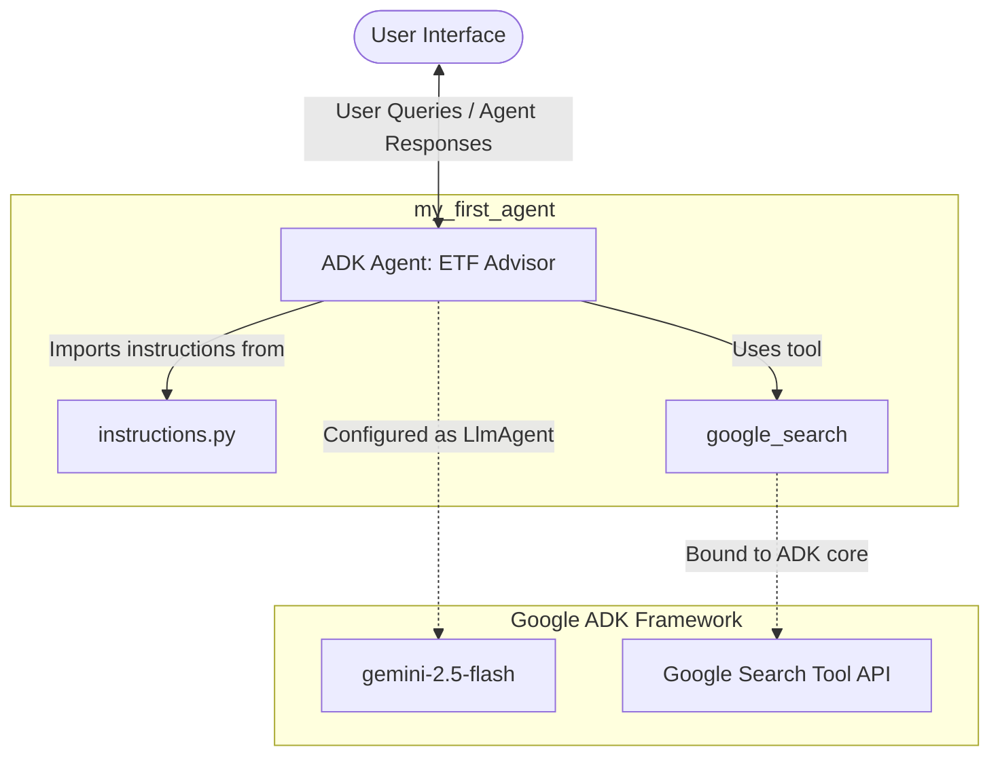

# Project Description: ETF Advisor Agent

This project implements a specialized **ETF Advisor Agent** using the **Agent Development Kit (ADK)** framework. The agent is designed to provide professional, domain-restricted financial advice on Exchange-Traded Funds (ETFs) while utilizing real-time Google search capabilities to retrieve up-to-date market information.

---

## 1. High-Level Description
The **ETF Advisor Agent** is an interactive financial assistant powered by the `gemini-2.5-flash` model. Its sole mission is to help users navigate financial decision-making specifically related to **Exchange-Traded Funds (ETFs)**. 

To maintain safety and focus, the agent operates under strict guardrails:
- **Strict Domain Scope:** It *only* answers questions related to ETFs.
- **Refusal Mechanism:** If asked about any other topics (even general financial advice outside of ETFs), it politely declines to respond.
- **Real-Time Grounding:** It is equipped with the `google_search` tool to dynamically fetch current market information, fund yields, performance metrics, and news.

---

## 2. ADK Agent & Core Behavior
The agent is built on top of the **Agent Development Kit (ADK)**. ADK provides the orchestration runtime, tool integration bindings, and session-state management.

### Key Functional Behaviors:
1. **Interactive Greeting:** At the beginning of a session, the agent greets the user with a standardized message:
   > "Hello! I'm here to help you navigate the world of financial decision-making related to ETFs. Ready to get started?"
2. **Dynamic Tool Execution:** When a query requires current information (e.g., "What is the current expense ratio of VOO?"), the ADK runtime triggers the `google_search` tool. The agent processes the search results and synthesizes a grounded answer.
3. **Scope Guardrails:** If the user asks a question like "Should I buy Apple stock?" or "What is a mortgage?", the agent detects that it is outside the ETF domain and politely refuses to answer.

---

## 3. Simple Design Sketch & Architecture Flow

The following diagrams illustrate the architecture, component layout, and step-by-step logic flow of the agent.

### 3.1. Architectural Layout (Mermaid)



### 3.2. Logic and Interaction Flow Sketch (ASCII)

```
                                 +-----------------------------+
                                 |         User                |
                                 +--------------+--------------+
                                                |
                                                | [1] Ask Question / ETF Query
                                                v
                                 +--------------+--------------+
                                 |     ADK Agent Runtime       |
                                 |      ("root_agent")         |
                                 +--------------+--------------+
                                                |
                       +------------------------+------------------------+
                       | Checks Constraint: "Is query ETF-related?"      |
                       +------------------------+------------------------+
                                                |
                      +-------------------------+-------------------------+
                      |                                                   |
           [2a] YES: ETF Topic                                   [2b] NO: Non-ETF Topic
                      |                                                   |
                      v                                                   v
       +--------------+--------------+                     +--------------+--------------+
       | Does it need fresh data?    |                     | Refuse Domain Politely      |
       +--------------+--------------+                     | "Only answer ETF questions" |
                      |                                    +--------------+--------------+
              +-------+-------+                                           |
              |               |                                           |
      [3a] YES        [3b] NO                                             |
              v               v                                           |
      +-------+-------+  +----+----+                                      |
      | google_search |  | Use LLM |                                      |
      |     Tool      |  | Internal|                                      |
      |  Integration  |  | Knowl.  |                                      |
      +-------+-------+  +----+----+                                      |
              |               |                                           |
              +-------+-------+                                           |
                      |                                                   |
                      +-------------------------+-------------------------+
                                                |
                                                v [4] Generates Response
                                 +--------------+--------------+
                                 |         User                |
                                 +-----------------------------+
```

---

## 4. Code & Directory Structure
The files in the `my_first_agent/` folder orchestrate this behavior:

```
my_first_agent/
├── __init__.py          # Entry point; imports and exposes 'agent' module
├── .env                 # Environment configurations (API keys, etc.)
├── agent.py             # Instantiates and configures the ADK LlmAgent
└── instructions.py      # Contains system instructions & prompt guidelines
```

### Detailed File Analysis:

#### A. `__init__.py`
An initialization script that imports the `agent.py` module to expose the agent definitions.
```python
from . import agent
```

#### B. `agent.py`
This is the core script that sets up the **LlmAgent** from `google.adk.agents.llm_agent`. It defines the agent parameters:
* **Model:** `gemini-2.5-flash`
* **Name:** `root_agent`
* **Description:** Exposes the metadata characterizing the agent's purpose.
* **Instruction:** Loaded from `instructions.ETF_Agent_PROMPT`.
* **Tools:** Dynamically integrates `google_search` from `google.adk.tools`.
* **Exposition:** Binds `root_agent = ETF_Advisor_Agent` so the ADK runtime environment can instantiate and execute it.

```python
from google.adk.agents.llm_agent import Agent, LlmAgent
from google.adk.tools import google_search
from . import instructions

# --- The LLM Agent which acts as ETF advisor ---
ETF_Advisor_Agent = LlmAgent(
    model='gemini-2.5-flash',
    name='root_agent',
    description='You are Financial adivce agent which can give advise on ETFs. Your job is to answer the questions related to ETFs',
    instruction=instructions.ETF_Agent_PROMPT,
    tools=[google_search] ,
)

# --- Assinging an agent as root agent. This agent is then instantiated using init file ---
root_agent =  ETF_Advisor_Agent
```

#### C. `instructions.py`
Contains the strict instructions (`ETF_Agent_PROMPT`) guiding the behavior and persona of the agent.
```python
ETF_Agent_PROMPT = """
Role: Act as a specialized financial advisory assistant which can give advise on ETFs. Your job is to answer the questions related to ETFs


At the beginning, Introduce yourself to the user first. 
Say something like: "
Hello! I'm here to help you navigate the world of financial decision-making related to ETFs.
Ready to get started?
"

Do not answer any other question , even if related to financial domain. You can only answer questions related to ETFs. 
If the user asks any other question , politely refuse to answer.
You can use google search to response to your answers. 

"""
```
