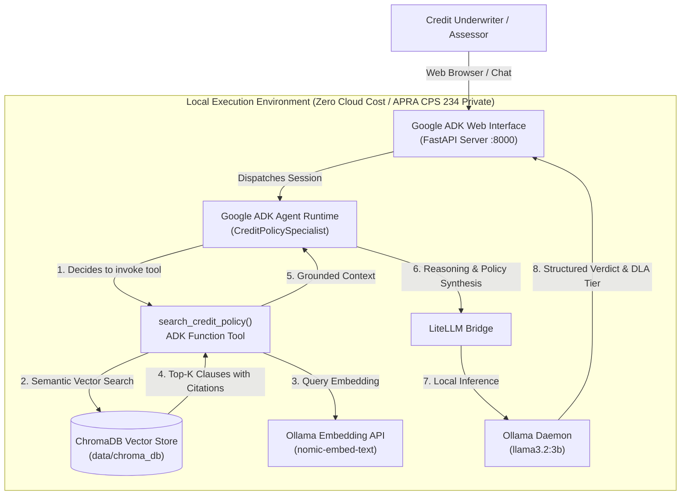
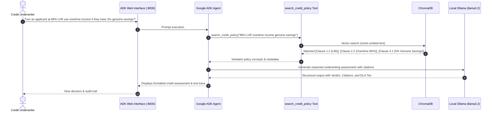

# Australian Credit Policy RAG Assistant (Agentic Architecture)

[](https://github.com/google/adk-python)
[-000000.svg)](https://ollama.com)
[](https://trychroma.com)
[](https://www.apra.gov.au)
[-brightgreen.svg)]()

> **Enterprise AI Architecture Showcase for Solutions Architects in Australian Banking**  
> An Agentic Retrieval-Augmented Generation (RAG) assistant designed for residential mortgage credit underwriting, exception assessment, and regulatory compliance.

---

## 1. Executive Summary & Business Problem

In Australian retail banking, mortgage underwriters and credit assessors spend up to **30% of their operational time** manually searching 80+ page credit risk manuals to evaluate non-standard loan parameters (e.g., self-employed income shading, high-density apartment LVR caps, or Debt-to-Income exceptions).

### Key Business Challenges
* **Turn-Around Time (TAT):** Delayed loan decisions impact broker customer satisfaction (NPS).
* **Policy Inconsistency:** Different assessors apply shading rules or exception criteria inconsistently.
* **Compliance Risk:** Under **APRA Prudential Practice Guide CPG 223** (Residential Mortgage Lending) and the **National Consumer Credit Protection (NCCP) Act**, credit providers must demonstrate verifiable, auditable adherence to responsible lending standards.

### The Architectural Solution
An autonomous **Agentic RAG Assistant** developed using **Google Agent Development Kit (ADK)**, backed by a **100% private, local inference engine (Ollama + Llama 3.2)** and **embedded vector database (ChromaDB)**. 

The assistant autonomous searches the bank's credit policies, retrieves exact governing clauses, applies income shading/LVR logic, and routes decisions according to the bank's **Delegated Lending Authority (DLA) exception matrix**.

---

## 2. Architecture & Design Patterns

### C4 Container Architecture Diagram



### End-to-End Sequence Flow



---

## 3. Architecture Decision Records (ADRs)

### [ADR-001] Local Model Inference for APRA CPS 234 Compliance
* **Context:** Australian financial institutions are bound by **APRA CPS 234 (Information Security)** and data privacy regulations regarding customer financial details.
* **Decision:** Utilize **Ollama** running locally on developer workstations rather than public cloud APIs.
* **Consequences:** 100% data residency within the local machine boundary; zero cloud API subscription costs; reproducible offline demonstrations for stakeholders.

### [ADR-002] Agentic Tool Use vs. Prompt Stuffing
* **Context:** Standard RAG pipelines stuff documents into the prompt regardless of user intent.
* **Decision:** Implement an **Agentic pattern via Google ADK**, where the LLM dynamically decides whether, when, and with what specific keywords to invoke the `search_credit_policy` retrieval tool.
* **Consequences:** Allows multi-step reasoning, query reformulation, and human-in-the-loop workflows in future phases.

### [ADR-003] Clause-Level Metadata Enrichment
* **Context:** Underwriters need exact paragraph references to include in credit approval memos.
* **Decision:** Enrich every document chunk during ingestion with structured metadata: `clause`, `section`, `source`, and `relevance_score`.
* **Consequences:** High auditability; eliminates hallucinations by forcing the agent to cite governing clause numbers.

---

## 4. Project Directory Structure

```
Credit Policy RAG Assistant/
├── credit_policy_agent/            # Google ADK Agent Package
│   ├── __init__.py                 # ADK app entrypoint
│   └── agent.py                    # Root Agent, System Instructions, LiteLLM config
├── data/
│   ├── policies/                   # INGESTION FOLDER: Drop your PDF, DOCX, or MD files here
│   │   └── aus_residential_mortgage_policy.md  # Comprehensive Australian mortgage policy manual
│   └── chroma_db/                  # Local persistent ChromaDB vector files
├── src/
│   ├── __init__.py
│   ├── config.py                   # Centralized configuration & environment constants
│   ├── document_loader.py          # Multi-format parser (PDF, Word, Markdown, Text)
│   ├── vector_store.py             # ChromaDB client & Ollama embedding generator
│   └── tools.py                    # Google ADK retrieval tool with clause citations
├── ingest.py                       # Standalone CLI ingestion pipeline script
├── run_web.py                      # One-click launcher for Google ADK Web UI
├── requirements.txt                # Pinned open-source dependencies
└── README.md                       # Architecture Blueprint & Documentation
```

---

## 5. Quickstart & Execution Guide

### Prerequisites
1. **Python 3.10+** (Virtual environment recommended)
2. **Ollama Installed & Running** (`http://localhost:11434`)
3. Downloaded Ollama models:
   ```powershell
   ollama pull llama3.2
   ollama pull nomic-embed-text
   ```

### Step 1: Install Dependencies
```powershell
pip install -r requirements.txt
```

### Step 2: Ingest Credit Policy Documents
Run the automated ingestion pipeline to scan `data/policies/`, extract clauses, generate embeddings, and populate ChromaDB:
```powershell
python ingest.py
```
*(You can drop your own bank policy PDFs or Word documents into `data/policies/` at any time and re-run this script).*

### Step 3: Launch Google ADK Web Interface
Start the interactive developer interface:
```powershell
python run_web.py
```
Open your browser to: **`http://127.0.0.1:8000`**

---

## 6. Sample Underwriting Queries to Test Live

Try asking the assistant these real-world Australian mortgage underwriting scenarios in the ADK Web UI:

1. **Overtime & Shading:**  
   > *"Can we include $30,000 of annualized overtime income for a PAYG nurse who has worked overtime for 18 months?"*  
   *Expected Response:* Cites `[Clause 2.2]`, applies 80% shading ($24,000 recognized), notes 12–24 month tenure requirement.

2. **Apartment Security Restriction:**  
   > *"A customer is purchasing a 44 square metre inner-city apartment in Melbourne (postcode 3000) at 80% LVR. Can this be approved?"*  
   *Expected Response:* Exception required. Cites `[Clause 1.3]`: Units under 50m² and high-density postcodes are capped at 70%–75% LVR. Requires Tier 3 Credit Committee sign-off.

3. **Genuine Savings & High LVR:**  
   > *"An applicant wants an 88% LVR loan using a $40,000 gift from their parents as deposit. Is this conforming?"*  
   *Expected Response:* Strictly non-conforming. Cites `[Clause 4.1]`: LVR > 80% requires minimum 5% genuine savings held >3 months. Gifts cannot satisfy the 5% genuine savings rule.

4. **Self-Employed Financials:**  
   > *"A self-employed contractor earned $150k in 2024 and $110k in 2025. What benchmark income do we use for serviceability?"*  
   *Expected Response:* Cites `[Clause 2.4]`: Profit declined by >20% (declined by 26.6%), so the lower Year 2 figure ($110,000) must be used.

---

## 7. Solutions Architect Interview Talking Points

When presenting this project to interviewers:
1. **APRA CPG 223 & Responsible Lending:** Emphasize how the agent eliminates underwriting ambiguity by enforcing exact income shading rules and living expense floors (HEM).
2. **Data Sovereignty & Zero Cloud Costs:** Highlight how running locally with Ollama aligns with APRA CPS 234 information security requirements, ensuring zero customer financial data leaves the perimeter.
3. **Google ADK & Enterprise Extensibility:** Explain why Google ADK was selected: its clean separation of Tools, State Management, and Multi-Agent Orchestration enables seamless future expansion into multi-agent workflows (e.g., Exception Evaluator Agent + Broker Communication Agent).
